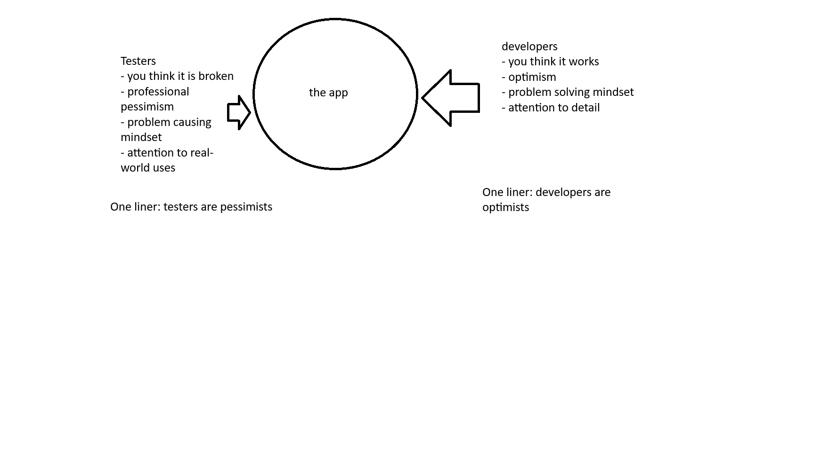

# What is testing?
- does QA = Testing?
    - yes and no

# Differing Paradigms

# Quality Management
- Devs are optimists
- Testers are pessimists
- How do we keep the two unified and not in tension?
- Quality Management is the solution

# QM Broken Down
- Quality Management has two subsets: Quality Control and Quality Assurance

## Quality Control
- Quality Control is product-oriented and corrective
    - works directly with "the app" and is focused on finding/fixing problems with "the app"
    - this will be our primary focus during training 
- the big idea: find and fix problems to make a good product
- One Liner: QC is about solving problems
- example: writing tests to validate code returns expected results

## Quality Assurance
- Quality Assurance is process-oriented and preventative
    - works with resources that are auxiliary to "the app"
        - documentation
        - workflows
        - test data
- the big idea: good process leads to a good product
- One Liner: QA is about preventing problems
- example: reviewing sprint workflow to verify all activities produce meaningful work artifacts

# Verification & Validation
- All QC will answer one of two questions:
    1. Are we building the product correctly?
    2. Are we building the right product?
- Question 1 is what we call "Verification"
    - consider we are building a social media application:
        - users should be able to register
        - log in
        - make posts
        - upload photos
        - etc
    - "Verification" is the process of "verifying" the correct features/resources/requirements of the product are present
    - "static testing" is typically done to perform "Verification"
        - Static testing is testing done without a running application
            - looking over source code
            - reviewing requirements
            - checking with stakeholders that features are correct
- Question 2 is what we call "Validation"
    - it does not matter how good our app is if it is not what the stakeholders actually asked for
    - "dynamic testing" is testing done with a running application
        - going back to the bike example, if we were to "validate" the bike works correctly, say for a cross country trip the client wants to take, we would quickly realize a regular bike is not suitable for the use case the client has
- Verification one liner: verification is testing an application and its auxiliary resources without the app running
- Validation one liner: validation is testing an application and auxiliary resources with the app running
    - training will primarily be focused on validation activities